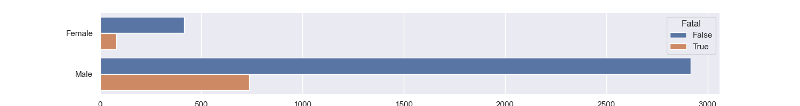
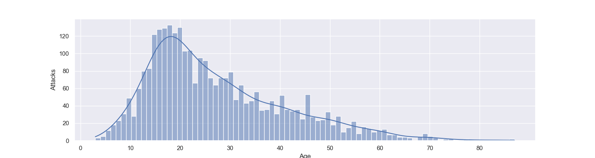
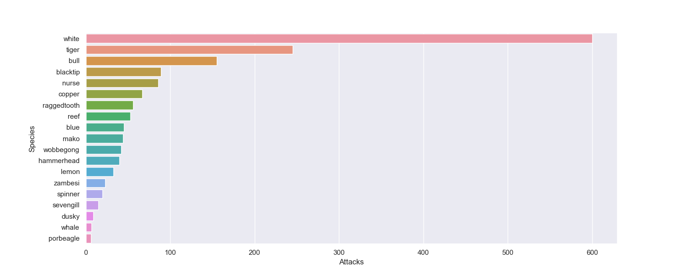

# IronHack Project1

# Shark attacks

## Project description
This project consists of a first attempt at the cleaning, structuring and visualizing data provided in a .csv file about shark attacks.

## Table of contents
1. How to run
2. Code step description
3. Data visualization

# How to run
In order to run this project the following libraries must be installed:
- Numpy
- Pandas
- Seaborn
- Matplotlib.pyplot

Access to Jupiter Notebook will alse be needed to easily execute de visualization part of this project.
In order to run this project you first need to run the Main.py to generate a new .csv with all the data cleaned and ready to be visualized.
Afterwards, running the viz_jupiter will let you see the different plots.

# Code step description

Step 1:
The main problem when first reading the attacks.csv file is that there's a lot columns and rows which are superfluous for the kind of analysis that we want to be performing. As such, the first step will be to get rid of all this unnecessary data. This happens in the Main file, but most functions are implemented in the clean.py, which will be imported into de main.py to call on them.

Step 2:
Once we have dropped all those columns and rows we have to start cleaning and refactoring the data. All the columns are string objects, and the majority of them don't have solid rules by which the data is written down. Some do, but not most. One such example is Activity and Species, where there is a lot of information very similar to others but because of typos and non-standard nomenclature, get read as diferent.

As such we clean all this information to be easily read.

Step 3:
Once all the data is clean in a DataFrame, we write it into a new attacks_clean.csv file from which we will get the info to later visualize it.

Step 4: 
On this step we begin using the Viz_jupiter file, in which we will show the data in various ways and using multiple relations. The main structure of the plots shown follows:
- General information
- Demographic data
- Geographic data
- Historic data
- Species data

# Data visualization
## General information
### Fatal vs Injured

### Type of attacks

## Demographic visualization
### Attacks by sex of the victim

### Attacks by sex and fatality

### Attacks by sex and type

### Historic of attacks by age

## Geographic visualization
### Comparision of Top3 countries with most attacks vs. the following seven

### Comparison of attacks per region in the Top3 most attacked countries

## Historic visualization

### Historic of attacks by activity and fatality

## Species visualization
### Total attacks by known/confirmed shark species

### Attacks by species, comparing Fatal and non Fatal attacks

### Historic of attacks by specie and fatality

### Attacks by species, activity and fatality
